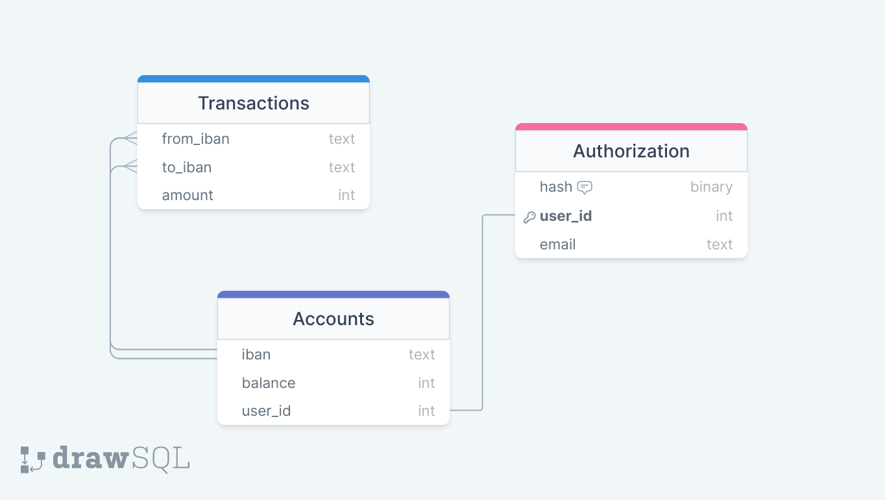

# Banking-API: Documentation

## Introduction:

This is a AWS-based online banking REST-API, which provides core functionalities of an online banking system. The whole program is written in Python and the data is stored in a MySQL-Database hosted on AWS. Have fun!

## Starting the Application:

To start the application, go into the folder `src/api`. There, you will find `apiInterface.py`.

Execute it with:

`python3 apiInterface.py`

Output:

`…`

`Running on http://127.0.0.1:5000`

`…`

This will start a server on your computer. Take the URL from the output and use the method specified below to get started!

## System Design:

### System Decomposition:

.png)

## Details:

### API Layer:

- REST-API in Python with Flask
- Provides access points to receive requests
- Each requests standard parameters are: email (string), password (string)
- Parameters should be sent in the body of the request

[Interface](https://www.notion.so/4ddc99cb60ee437e8941e19f5aa19dda)

**Responses:**

General:

In general, if required parameters are missing in the body, the responses will point that out.

If for example the parameter “email” was not included in the request, the response would look like following:

**404:**

`{`

`“message” :  “Email not given”`

`}`

All the responses below are assuming that you included all required parameters into the request.

Create Account:

 if successful:

**200:**

`{`

`“iban” :  IBAN (string)`

`}`

else:

**404:**

`{`

`“message” :  “Could not create new account”`

`}`

Add Account:

 if successful:

**200:**

`{`

`“iban” :  IBAN (string)`

`}`

else:

**404:**

`{`

`“message” :  “Could not create new account”`

`}`

Transfer Money:

if successful:

**200**

else:

**404:**

`{`

`“message” :  “Could not transfer money”`

`}`

Retrieve Balance:

 if successful:

**200:**

`{`

`“balance” :  account_balance (int)`

`}`

else:

**404:**

`{`

`“message” :  “Could not retrieve balance”`

`}`

Retrieve Transfer History:

 if successful:

**200:**

`{`

`“sent” :  [(IBAN of receiver, amount), ... ,(IBAN of receiver, amount)]`

`“received” :  [(IBAN of sender, amount), ... ,(IBAN of sender, amount)]`

`}`

with:

`IBAN of receiver (string)`

`IBAN of sender (string)` 

`amount (int)`

else:

**404:**

`{`

`“message” :  “Could not retrieve transfer history”`

`}`

### Business Layer:

- Processes API Requests accordingly to the Business Logic and Access Rights, written in Python
- Ensures unique IBAN, Access Rights, etc.
- Communicates with the Database Layer by generating SQL Queries

### Database Layer:

- AWS RDS Database (MySQL)

Database Structure:

## Next Goals:

- Deploy application on an instance on AWS
- Add functionalities like transfer by mail!
- Optimize Query Operations

## Additional Information:

### Total lines of code:

1422 Lines 

→ 581 Lines of Implementation

→ 841 Lines of Tests and Tools1
